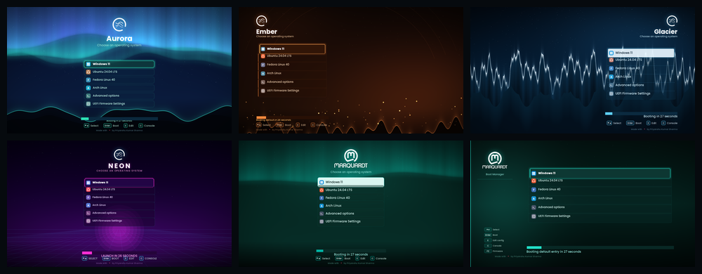

<div align="center">

# GRUB Boot Theme

**Give your GRUB2 boot menu a little more personality.**<br>
Six color palettes, a simple installer, and a live preview gallery.

[Browse the theme previews](docs/preview.html) · [Install a theme](#-quick-install) · [Troubleshooting](#-troubleshooting) · [Report a problem](https://github.com/itspriyanshuks17/grub-boot-loader/issues)




</div>

---

<details open>
<summary><strong>At a glance</strong></summary>

- Pick from **six palettes** using the interactive installer.
- Preview the palettes in the [theme gallery](docs/preview.html) or the [project website](docs/index.html).
- The installer detects common GRUB configuration commands, including `update-grub` and `grub2-mkconfig`.
- Use `sudo ./install.sh --switch` to choose among themes already installed on the system; a normal run offers to install a new theme.

</details>

## 🎨 Find your palette

| Theme | Palette | Character |
|:--|:--|:--|
| **Aurora** | Teal `#2de3b5` · Purple `#7c5cff` | Cool sky |
| **Ember** | Orange `#ff8a3d` · Red `#e0245e` | Warm fire |
| **Glacier** | Blue `#5cc8ff` · Deep blue `#2a6bff` | Ice cold |
| **Neon** | Pink `#ff3da5` · Cyan `#22e5ff` | Synthwave |
| **Classic** (`marquardt`) | Teal `#009aa6` · Deep teal `#0b3a41` | Original branded look · access key required |
| **MQ** | Teal `#009aa6` · Dark teal `#0b4f5c` | Branded dark teal · access key required |

> Click a theme in the [website](docs/index.html) to explore its colors. Classic and MQ are access-key protected in the installer.

## ⚡ Quick install

> **This changes GRUB configuration.** Make sure you can recover your system and understand your machine's boot policy before proceeding. Managed devices may require administrator approval.

```bash
git clone https://github.com/itspriyanshuks17/grub-boot-loader.git
cd grub-boot-loader
sudo ./install.sh
```

Choose a theme from the numbered menu. The script installs its files, updates `/etc/default/grub`, and regenerates the GRUB configuration.

<details>
<summary><strong>Install a specific theme or manage the current one</strong></summary>

Install a named theme directly:

```bash
sudo ./install.sh --theme aurora
```

To switch among theme files already installed on the system, the installer shows the current theme and lists installed choices:

```bash
sudo ./install.sh --switch
```

To install another bundled theme, run `sudo ./install.sh` and choose **Install a new theme**.

To uninstall:

```bash
sudo ./install.sh --uninstall
```

The installer keeps the first backup it creates at `/etc/default/grub.bak-grubtheme`.

</details>

## 🧰 Built with

| Part | Languages and tools |
|:--|:--|
| Theme installer | **Bash** · GNU/Linux shell utilities · GRUB2 tools (`update-grub`, `grub-mkconfig`, or `grub2-mkconfig`) |
| Project website and gallery | **HTML5**, **CSS3**, and **vanilla JavaScript** · GitHub Pages friendly static files |
| Boot menu themes | GRUB theme configuration (`theme.txt`) · PNG artwork |
| Project workflow | **Git** and **GitHub** |

No web framework or JavaScript package installation is needed to view the site.

## 🖥️ Manual installation

If you want to configure GRUB yourself, copy a theme folder and point `GRUB_THEME` at its `theme.txt` file:

```bash
sudo cp -r themes/aurora/ /boot/grub/themes/aurora
```

Add or update these settings in `/etc/default/grub`:

```bash
GRUB_THEME="/boot/grub/themes/aurora/theme.txt"
GRUB_GFXMODE=1920x1080,auto
```

Regenerate the configuration using the command for your distribution:

```bash
sudo update-grub
# Fedora / RHEL (common configuration path):
sudo grub2-mkconfig -o /boot/grub2/grub.cfg
```

## 🛠️ Troubleshooting

<details>
<summary><strong>The theme does not appear after reboot</strong></summary>

Check that `GRUB_THEME` points to the installed theme's `theme.txt`, graphical output is enabled, and `GRUB_GFXMODE` is set. Then regenerate GRUB's configuration and reboot.

</details>

<details>
<summary><strong>Fedora ignores <code>GRUB_THEME</code></strong></summary>

Some Fedora systems using Boot Loader Specification (BLS) entries may require additional configuration. The project website's [FAQ](docs/index.html#faq) describes one possible setting; review your system's setup before changing it.

</details>

<details>
<summary><strong>Want to preview without installing?</strong></summary>

Open the [static theme gallery](docs/preview.html) in a browser. It does not make system changes.

</details>

## 📁 Project map

```text
themes/             GRUB theme folders and artwork
theme/              Original source theme assets
install.sh          Interactive installer and uninstaller
docs/index.html     Project website
docs/preview.html   Standalone theme gallery
docs/style.css      Website styles and responsive layouts
docs/app.js         Theme picker, installer guide, and appearance toggle
```

## 🤝 Contributing

Found a bug or have an idea? [Open an issue](https://github.com/itspriyanshuks17/grub-boot-loader/issues) with your Linux distribution, GRUB version, and the steps to reproduce it. Pull requests with clear descriptions are welcome.

## 📄 License

MIT licensed.
