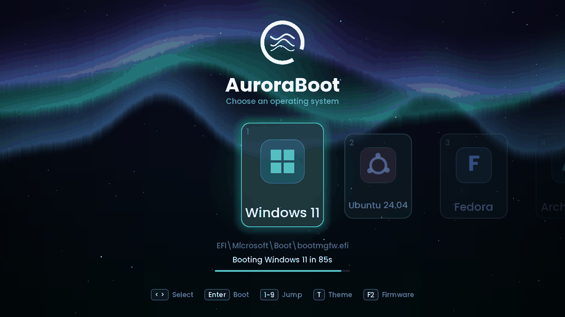
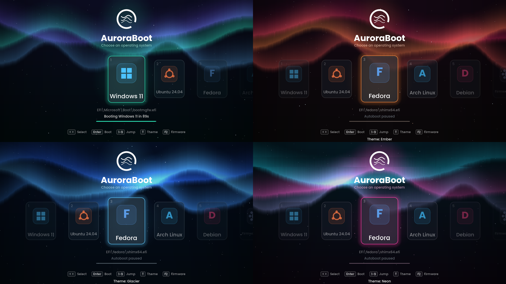

# AuroraBoot

An animated, keyboard- and mouse-driven **UEFI boot menu** written from scratch in C (~1,300 lines, no
dependencies at runtime). Aurora sky, twinkling stars, glass cards that glide and glow, live theme switching,
countdown, fade-out boot transition. It chain-loads your existing bootloaders, so it never replaces or edits them.


<sub>Real frames captured from the bootloader running in QEMU/OVMF (about 9 fps here because the VM has no GPU or KVM; on real hardware it is meant to run much smoother).</sub>



## Features
- Smooth 60 fps-capped render loop with time-based easing (scrolling carousel, glow, fades, intro sequence)
- Animated aurora ribbons + starfield, four built-in themes (`Aurora`, `Ember`, `Glacier`, `Neon`) and your own brand colors
- Auto-detects Windows, Ubuntu, Fedora, Debian, Arch, openSUSE, Mint, Pop!_OS, Manjaro, Kali, Zorin, rEFInd, systemd-boot, UEFI Shell, removable media, and any other `\EFI\<name>\shimx64.efi|grubx64.efi`
- Extra cards: **Firmware Setup**, **Restart**, **Shut Down**
- Custom logo compiled in (`make assets LOGO=your.png`), custom accent colors, hide/add entries via one config file
- Anti-aliased Poppins text, rounded shapes, procedural icons: everything is software rendered to the UEFI GOP framebuffer

## Keys
| Key | Action |
|---|---|
| `<` `>` / `^` `v` | select |
| `Enter` / `Space` | boot the selected card |
| `1`-`9` | jump to card |
| `Home` / `End` | first / last card |
| `T` | cycle theme (smooth color blend) |
| `F2` | reboot into firmware setup |
| `I` | replay the intro animation |
| any key | stops the autoboot countdown |

Mouse (hover to select, click to boot) is implemented through the UEFI Simple Pointer protocol but is **experimental
and untested**: I could not verify it in the emulator.

## Try it safely in a VM (recommended first step)
```bash
sudo apt install gnu-efi gcc make qemu-system-x86 ovmf     # Debian/Ubuntu
make && make run                                           # opens QEMU with demo entries
```
`make run` uses `config/demo.conf` (fake entries, nothing is ever booted). `tools/screenshot.py` regenerates the
screenshots and the GIF headlessly.

## Install on a real machine
1. **Read "Limits" below first.**
2. Linux: `sudo install/install-linux.sh --try` boots AuroraBoot **once** on next restart; your normal boot order is
   untouched. If you like it, run `sudo install/install-linux.sh --first` to make AuroraBoot the default firmware
   entry. The installer places `AuroraBoot.efi` and `aurora.conf` in the mounted EFI System Partition at
   `EFI/AuroraBoot/` (usually `/boot/efi/EFI/AuroraBoot/` on Ubuntu). The default command adds an entry but leaves
   boot order unchanged. Choosing Ubuntu in AuroraBoot starts Ubuntu's existing shim/GRUB, so GRUB appears after
   AuroraBoot; AuroraBoot does not replace Ubuntu's bootloader. Undo with `--uninstall`.
3. Windows: `install\install-windows.ps1 -Try` from an elevated PowerShell (**experimental, untested**).
4. Manual: copy `AuroraBoot.efi` and `aurora.conf` to `<ESP>/EFI/AuroraBoot/` and add a boot entry with
   `efibootmgr` or your firmware menu.

Prebuilt binary: `dist/AuroraBoot.efi` (x86_64).

## Configuration (`<ESP>/EFI/AuroraBoot/aurora.conf`)
See [`config/aurora.conf`](config/aurora.conf). Highlights: `timeout`, `default`, `theme`, `accent`/`accent2`,
`resolution`, `show_title`, `hide`, and `[entry]` blocks for extra loaders.

## Use your own logo / brand
```bash
pip install pillow numpy
make assets LOGO=my-logo.png LOGO_MODE=alpha        # alpha | white-on-color | dark-on-light
make
```
Then set `accent = #RRGGBB` and `show_title = false` in the config if the logo already contains your name.
The logo is drawn white; use a transparent PNG or one of the other modes. Respect trademark rules for logos you
do not own and do not publish builds containing them.

## How it works
`src/gfx.c` is a small software renderer (alpha blending, SDF rounded rectangles, bilinear alpha-mask text, a
quarter-resolution aurora field that is bilinearly upscaled each frame). `src/main.c` is the state machine and UI,
`src/entries.c` scans every FAT volume for loaders and boots them with `LoadImage`/`StartImage`, `src/config.c`
parses the config. `tools/gen_assets.py` bakes the font atlas, logo and sine table into `src/assets.h`.

## Limits (please read)
- **Secure Boot:** AuroraBoot is unsigned. With Secure Boot enabled, firmware refuses to run it. Options: disable
  Secure Boot (not possible or allowed on many managed/company laptops), or sign the binary with your own key and
  enroll it (MOK / `db`). Signing is not automated here.
- **BitLocker / TPM:** changing boot entries can trigger a BitLocker recovery prompt on some setups. Have your
  recovery key. Keep your existing Windows Boot Manager entry; this project never modifies it.
- **Tested only in QEMU + OVMF (x86_64, 1920x1080, Secure Boot off).** Not yet tested on real hardware, other
  architectures, Windows dual-boot chain-loading, the Windows installer script, or the mouse.
- Chain-loads EFI executables only; it does not boot kernels directly and has no encrypted-disk support.
- On a company-managed machine, ask IT before touching boot configuration.

## Contributing
Issues and PRs welcome, especially real-hardware test reports. `make` must stay warning-light and dependency-free.

MIT licensed. Fonts: Poppins (OFL). See `NOTICE.md`.
